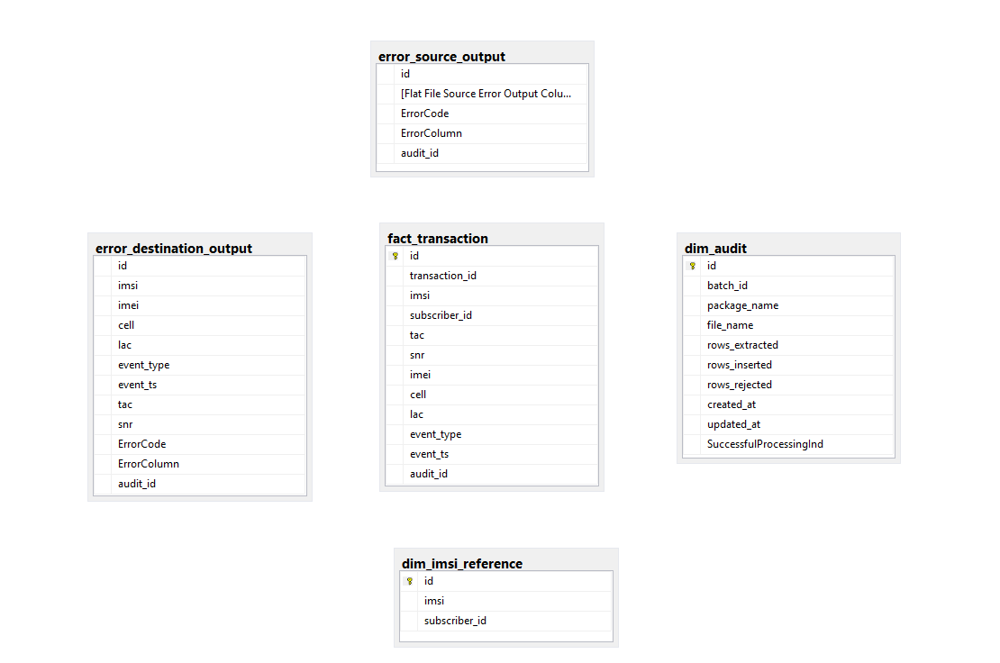
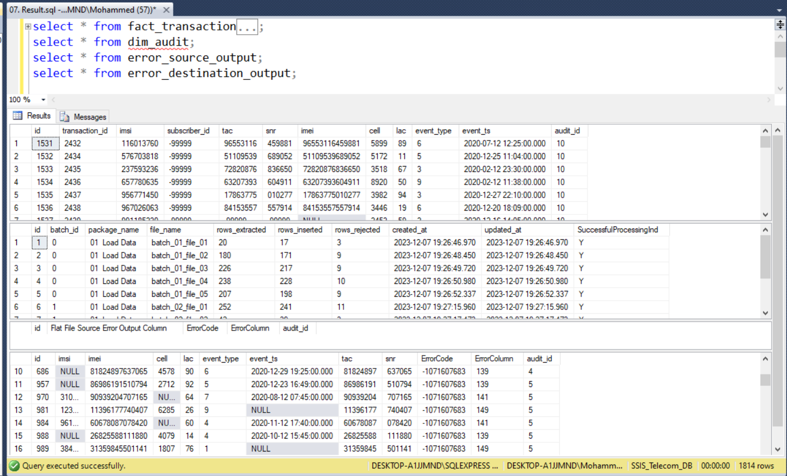

# ETL Project for Telecom Company
The Telecom ETL project leverages SQL Server Integration Services (SSIS) for efficient extraction, transformation, and loading of telecommunications data. Key features include seamless data integration, robust ETL processes, and an organized data model for enhanced analysis.

## Project Description
Telecom company has a system that saves a CSV file periodically, every 5 minutes. This file includes basic data for the various transactions made by customers during a specific period of time.

- The company provided the following table, illustrating the data stored in the CSV file:

- The processing required should be completed on this data before storing it in the database

- For rejected transactions, a dedicated table will be utilized for storage, accompanied by the logging of the original CSV file name.

-  During the data registration process in the database, there are additional details that need to be recorded to ensure the quality of the data storage process:   
            
1. Number of transactions in the CSV file.
2. Number of transactions successfully stored in the 
3. database.
4. Number of rejected transactions due to not meeting the required conditions.
5. Linking the stored data in the database with the original CSV file.

- After loading data move the files into an archive folder

## Project Values
- Analysis Business Demands
-  Data Creation (Tables and Attributes)
-  Data Extraction and Transforming using SSIS Package
-  Source and Destination Error Handling
Auditing

## Data Source

These  [CSV files](https://github.com/Al-Moatasem/ETL-Telecom-SSIS)
contain fundamental data related to various customer transactions within a specific time period.

## Tools
- SQL Server
- SQL Server Integration Services (SSIS) 
## Package Design
It consist of Control Flow and Data Flow
### Control Flow

- Every run for the package we get new batch_id depending on the last batch_id at the audit_dim.
- Iterates the data files to extract data from it.
- Inserting a new record in the audit dimension includes batch_id, package name, file name.
- Executing the data flow task which makes the files data to the database and get the required auditing data like rejected_rows, inserted_rows and all_rows processed.
- Updating the auditing record with the number of proccessed rows, rejected rows and inserted rows.
- Moving the processed files to another location (Archiving).

### Data Flow

- Reading the data from the files and check if it is matched with the data quality rules we made.
- If it is rejected from source, it will be stored in error_source_output table.
- If it is matched with the distenation constraints, it will be inserted.
- If it is not matched, it will ne recorded in the error_destination_output table.
- Getting the number of rejected and inserted data for auditing purposes.
- Mapping the audit_id to the tables audit_id
- Making the required derived columns like tac and snr columns from imei column.
### Database Schema Design

## Result

## References

- [ETL - Telecom - Garage Education](https://docs.google.com/document/d/1CsG6QS6Hh-T6x-luJoGlx2eJq6CXvfbwKB7977bjc8o/edit#heading=h.19m67h56174d)
- [Telecom-ETL](https://github.com/amrelauoty/Telecom-ETL-SSIS)
- [Data source](https://github.com/Al-Moatasem/ETL-Telecom-SSIS)